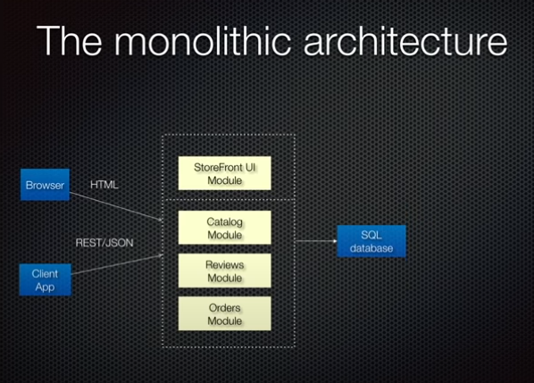

# Microservices + Events + Docker = A Perfect Trio

## Agenda

- Monolith vs. Microservices
- Event-driven microservices
- Developing and deploying microservices using docker

In order to develop a successful software, there are three important things to consider.

Architecture of the system, organizational structure and the process we have to use. The idea for the organization structure is rather than having very very large development team, you break up your engineering team into smaller teams. These teams should be autonomous. There is also a lot of consensus to say that we should be developing using the Agile processes. In that way we have small autonomous agile teams who are delivering continuously.

## Architecture

There are two choices for building an architecture.

- Monolithic Architecture
- Microservices Architecture

### Monolithic Architecture

Let's look at the monolithic approach

Assume we have an online store, consists of different modules responsible for different business functionalities. It's layered and modular, there's a presentation layer, catalog layer, orders layer and reviews layer. All of the layers communicating with single shared database. All of the layers exposed via RESTful API and traditional HTML rendering for browser. It's kind of nice layered and modular structured application. When we used the monolithic approach we package everything up as the application. All of the layers and modules are tightly coupled.

Benefits of this approach is simple to develop, test, deploy and scale. The problem in this approach is when we build the application we just don't abandoned them once it's been deployed. Successful applications has a habit of keep growing and growing. When the application gets bigger it's no longer agile, autonomous and can't use continuous delivery.

The solution to these problems are to apply functional decomposition. The term were introduced by an architect of ebay in his book [Art of Scalability, The: Scalable Web Architecture, Processes, and Organizations for the Modern Enterprise]([https://link](https://www.amazon.com/Art-Scalability-Architecture-Organizations-Enterprise/dp/0134032802))

